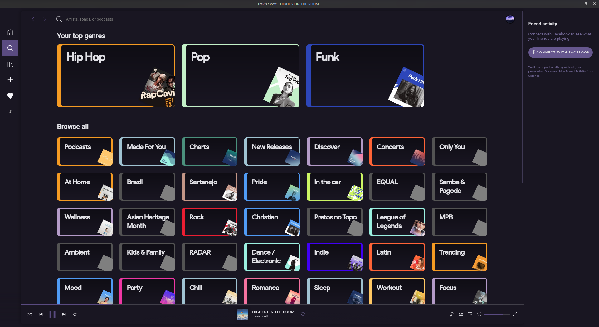

<h1 align="center">
   
  
   
  Omni for <a href="https://github.com/khanhas/spicetify-cli">Spicetify</a>
   
</h1>

  <strong>Dark theme for <a href="https://github.com/khanhas/spicetify-cli">Spicetify</a></strong>

  

  

  <a href="#install">Install</a> •
  <a href="#team">Team</a> •
  <a href="#license">License</a>

  

## Install

All instructions can be found at [INSTALL.md](./INSTALL.md).

## Team

This theme is maintained by the following person(s) and a bunch of [awesome contributors](https://github.com/getomni/spicetify/graphs/contributors).

|  |
| ----------------------------------------------------------------------------------------------- |
| [João Inácio](https://github.com/birobirobiro)                                                  |

## License

[GPL-3.0 License](./LICENSE.md)

---

Based on [Dribbblish](https://github.com/morpheusthewhite/spicetify-themes/tree/master/Dribbblish)
